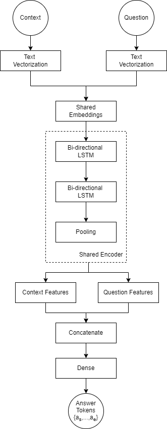
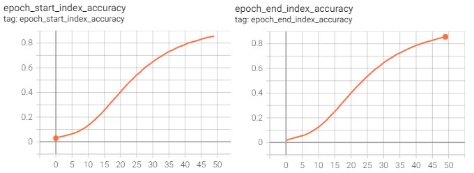

# Question Answering NLP Project

This project was done as part of AISERA's NLP coding exercise. 
I coded from scratch a deep-learning based NLP model for Question Answering and trained it on the SQUAD dataset.

### Requirements

```shell
pip install tensorflow numpy nltk tqdm
```

### Train

You can train a model with the default parameters as follows: 

```shell
python train.py --path_to_train_dataset "datasets/SQUAD/train-v1.1.json" --path_to_test_dataset "datasets/SQUAD/dev-v1.1.json" --outputs_dir "D:/trainings/aisera"
```

For more options and their explanations check ``train.py``.

### Infer

You can supply a model checkpoint, a context paragraph as a .txt file, and a question whose answer appears in the context:

```shell
python infer.py --checkpoint "checkpoints/epoch_49.loss_1.3365.val_loss_16.8641" --context_txt "example/context.txt" --question "The majority of building construction jobs are what?"
```

### Architecture

The inputs to our model is a (P, Q) text pair, where P is a context paragraph and Q is a question.
Words are mapped to integer sequences using a vectorization model with a vocabulary of size V 
adapted on the SQUAD dataset. Word vectors are subsequently mapped to trainable D-dimensional embeddings.
Features are extracted from the embeddings using a neural encoder made up from 2 bi-directional
LSTM layers. Finally, these features are used to predict the span of tokens {a<sub>s</sub>,...,a<sub>e</sub>}
where the answer is in the context paragraph P.



Using shared weights between context and question embedding layers, as well as between
encoder layers, we allow the model to incorporate information from both the context and
the question through the entire processing stack to make its final decision. With the default
training setting the model has ~2M parameters.

### Results

We use the train set for training and the dev set for validation.
We train the model for 50 epochs, and we validate every epoch. Our performance evaluation metric
is the accuracy with which the model can predict the start a<sub>s</sub> and end a<sub>d</sub> tokens
of the answer span in the context, relative to all the context tokens.

The model reaches around 82% accuracy for predicting the start token and a similar accuracy for
predicting the end token. However, we did observe some overfitting to the training set, despite efforts
to mitigate it, such as reducing the learning rate and trying dropout and regularization.



When using the model for inference, with the example command provided above, the
input context and question and the output answer are as follows:

Context:
```text
It is commonly believed that the earlier a defect is found, the cheaper it is to fix it. The following table shows the cost of fixing the defect depending on the stage it was found. For example, if a problem in the requirements is found only post-release, then it would cost 10\u2013100 times more to fix than if it had already been found by the requirements review. With the advent of modern continuous deployment practices and cloud-based services, the cost of re-deployment and maintenance may lessen over time.
```

Question:
```text
What determines the cost of fixing a bug?
```

Answer:

```text
the earlier a defect is found
```
