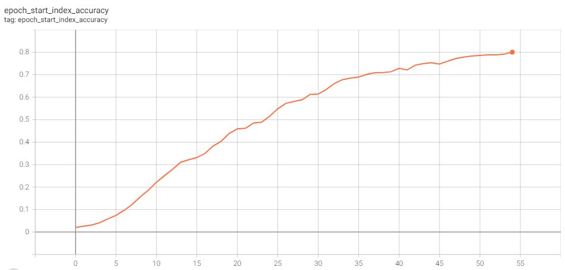

# Question Answering NLP Project

This project was done as part of AISERA's NLP coding exercise. 
I coded from scratch a deep-learning based NLP model for Question Answering and trained it on the SQUAD dataset.

### Requirements

```shell
pip install tensorflow numpy nltk
```

### Train

You can train a model with the default parameters as follows: 

```shell
python train.py --path_to_train_dataset "datasets/SQUAD/train-v1.1.json" --path_to_test_dataset "datasets/SQUAD/dev-v1.1.json" --outputs_dir "D:/trainings/aisera"
```

For more options and their explanations check ``train.py``.

### Infer

You can supply a model checkpoint, a context paragraph as a .txt file, and a question whose answer appears in the context:

```shell
python infer.py --checkpoint "checkpoints/epoch_54.loss_1.8427.val_loss_13.9464" --context_txt "example/context.txt" --question "The majority of building construction jobs are what?"
```

### Architecture

The inputs to our model is a (P, Q) text pair, where P is a context paragraph and Q is a question.
Words are mapped to integer sequences using a vectorization model with a vocabulary of size V 
adapted on the SQUAD dataset. Word vectors are subsequently mapped to trainable D-dimensional embeddings.
Features are extracted from the embeddings using a neural encoder made up from 2 bi-directional
LSTM layers. Finally, these features are used to predict the span of tokens {a<sub>s</sub>,...,a<sub>e</sub>}
where the answer is in the context paragraph P.


Using shared weights between context and question embedding layers, as well as between
encoder layers, we allow the model to incorporate information from both the context and
the question through the entire processing stack to make its final decision.

### Results

We use the train set for training and the dev set for validation.
We train the model for 50 epochs, and we validate every epoch. Our performance evaluation metric
is the accuracy with which the model can predict the start a<sub>s</sub> and end a<sub>d</sub> tokens
of the answer span in the context, relative to all the context tokens.

The model reaches around 82% accuracy for predicting the start token and a similar accuracy for
predicting the end token. However, we did observe some overfitting to the training set, despite efforts
to mitigate it, such as reducing the learning rate and trying dropout and regularization.



When using the model for inference, with the example command provided above, the
input context and question and the output answer are as follows:

Context:
```text
Building construction is the process of adding structure to real property or construction of buildings. The majority of building construction jobs are small renovations, such as addition of a room, or renovation of a bathroom. Often, the owner of the property acts as laborer, paymaster, and design team for the entire project. Although building construction projects typically include various common elements, such as design, financial, estimating and legal considerations, many projects of varying sizes reach undesirable end results, such as structural collapse, cost overruns, and/or litigation. For this reason, those with experience in the field make detailed plans and maintain careful oversight during the project to ensure a positive outcome.
```

Question:
```text
The majority of building construction jobs are what?
```

Answer:

```text
small renovations
```
